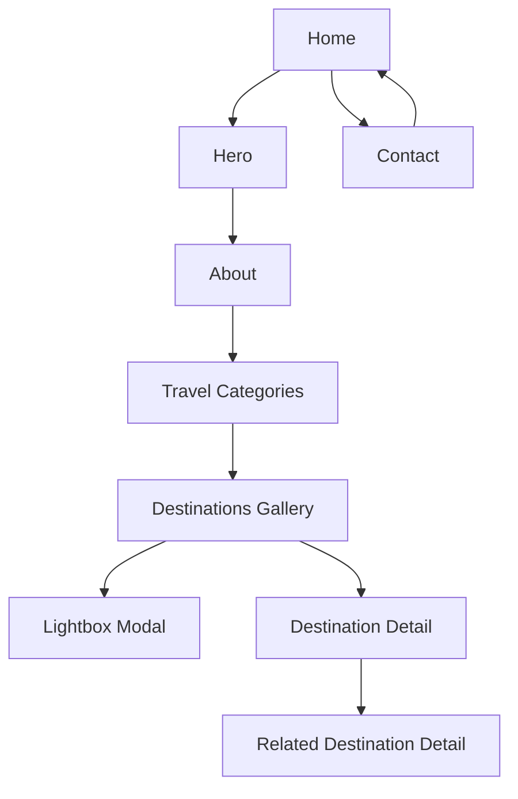

## 1. Product Overview
A single-page cultural tourism microsite showcasing India & Sri Lanka with a curated set of destinations, cultural highlights, and media.
It must strictly use the provided local assets and include the mandated visual effects/interactions described below.

## 2. Core Features

### 2.1 User Roles
Not required (public brochure site; no authentication).

### 2.2 Feature Module
This tourism site consists of the following essential pages (asset-driven; no backend):
1. **Home**: sticky navigation, hero, about, travel categories (Culture/Business/Entertainment), destination gallery, media, footer.
2. **Destination Detail** (e.g., Taj Mahal): destination hero image, key facts, short story, related destinations, link back to Home.
3. **Contact**: contact information + lightweight message form (non-persistent), link back to Home.

### 2.3 Page Details
| Page Name | Module Name | Feature description |
|-----------|-------------|---------------------|
| All pages | Strict asset rules (folder/name requirements) | Use ONLY the existing local assets listed below; do not rename folders/files; reference paths exactly as written (including spaces/case); do not use external images, icon libraries, fonts, or embedded media URLs. |
| All pages | Asset manifest (allowed files) | Logo/logo.png; Hero Banner/india-sri-lanka-hero.jpg.png; Features/street-food-thali.png; Features/tea-plantation-workers.png; Features/temple-stupa.png; Gallery/Golden_Temple.jpg; Gallery/Sree_Padmanabhaswamy_Temple.jpg; Gallery/galle-fort-lighthouse.jpg; Gallery/kerala-backwaters.png; Gallery/sigiriya-lion-rock.jpg; Gallery/tajmahal.jpg; Media/culture.mp4; Media/folk.mp3. |
| Home | Header / Navigation | Show logo; provide navigation to Home sections (Hero, About, Categories, Gallery, Media, Footer) plus page links (Contact); keep header sticky on scroll; highlight active Home section while scrolling. |
| Home | Hero | Display hero banner with overlay text; provide primary CTA to Destinations Gallery; ensure readability (overlay gradient). |
| Home | About | Explain the India & Sri Lanka cultural travel theme with concise copy; include a short bulleted value list. |
| Home | Travel categories (new) | Show 3 category cards (Culture, Business, Entertainment) using existing feature/gallery imagery; link each card to a curated subset of destinations (anchors or in-page list) without fetching remote data. |
| Home | Destinations gallery | Render 6 destination tiles using Gallery/* assets; each tile supports (1) open lightbox and (2) open its Destination Detail page. |
| Home | Culture media | Provide video player for Media/culture.mp4 + caption; provide audio player for Media/folk.mp3 + brief context; prevent autoplay. |
| Home | Footer | Show copyright line, internal Home section links, a link to Contact, and “Back to top” CTA. |
| Destination Detail (template) | Page header + breadcrumbs | Show consistent header; show breadcrumb “Home / Destination Name”; provide clear back link to Home gallery. |
| Destination Detail (template) | Destination hero + facts | Use the destination’s Gallery image as hero; show destination name, country tag (India/Sri Lanka), and 3–5 quick facts (short, static copy). |
| Destination Detail (template) | Description + related destinations | Show 1–2 paragraphs describing the destination; show 2–3 related destination cards that link to other detail pages (reuse existing Gallery images). |
| Destination Detail (template) | Effects (interaction) | Reuse hover transitions and scroll-reveal; optional lightbox reuse for the hero image. |
| Contact | Contact info | Show a clear email and location line (static text); no external map embeds. |
| Contact | Message form (non-persistent) | Provide Name/Email/Message fields with client-side required validation; submission may be UI-only (no storage) and must not call any backend. |

## 3. Core Process
**Visitor flow (public user):**
1. Land on Home (Hero), read headline, use CTA to jump to Gallery.
2. Scroll through About and the new Travel Categories to decide what to explore (Culture/Business/Entertainment).
3. Browse the Destinations Gallery.
4. From a destination tile, either:
   - Open the lightbox to view imagery quickly, or
   - Open the Destination Detail page to read more about that place.
5. From a Destination Detail page, use “Back to Gallery” or open a related destination.
6. If needed, open the Contact page from navigation.

