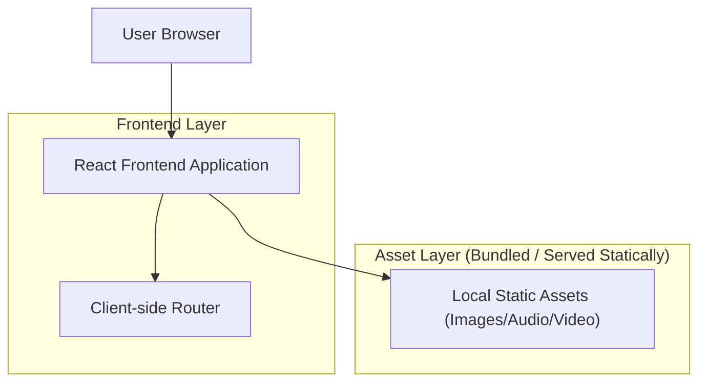

## 1.Architecture design

## 2.Technology Description
- Frontend: React@18 + vite + tailwindcss@3 + react-router-dom
- Backend: None (static asset-driven site)

## 3.Route definitions
| Route | Purpose |
|-------|---------|
| / | Home page with in-page anchors (#hero, #about, #categories, #gallery, #media, #footer) |
| /destinations/:slug | Destination detail page (e.g., /destinations/taj-mahal) using local Gallery/* assets |
| /contact | Contact page (static contact info + non-persistent form) |

## 6.Data model(if applicable)
Not applicable (no persisted data required for this microsite).